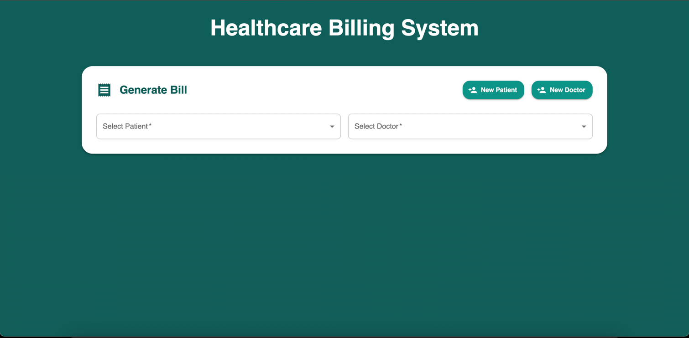
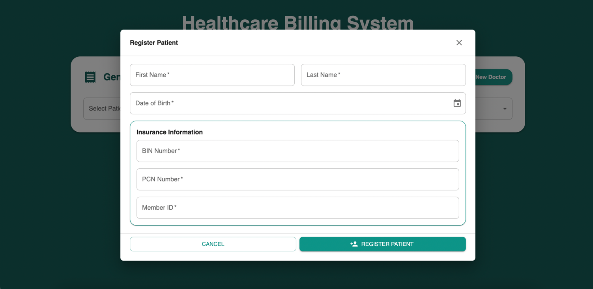
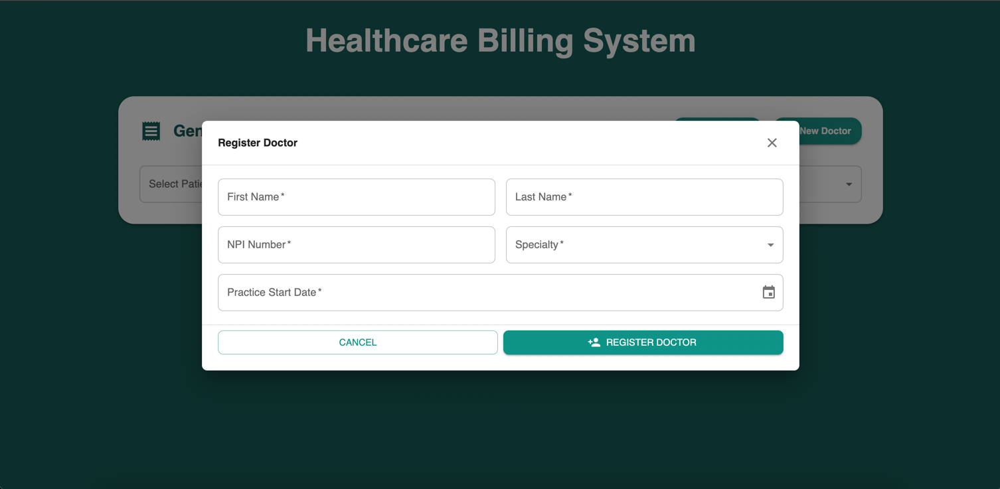
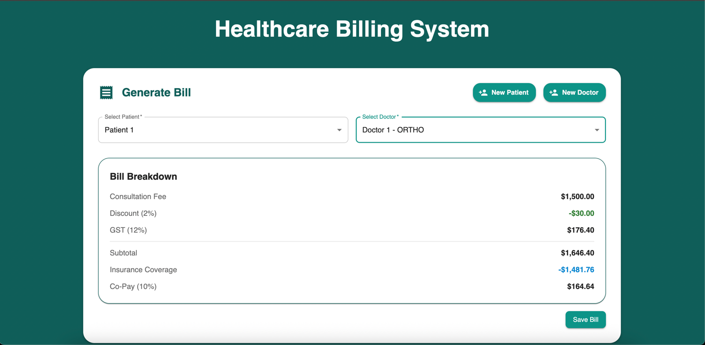

# Healthcare Billing System

A comprehensive healthcare billing management system with billing calculations, patient management, and doctor management features.

### Backend (Micronaut + Kotlin)

- REST API for patients, doctors, and billing
- Automated billing calculations (tax, co-pay, discounts, insurance)
- H2 database for development/testing

### Frontend (React + TypeScript)

- Feature-based UI for patient, doctor, and billing workflows
- MUI-based components and theme
- API integration via centralized client

## Project Structure

This is a full-stack application with:
- **Backend**: Micronaut 4.10.7 + Kotlin (JDK 21)
- **Frontend**: React 19 + TypeScript + Vite + Material-UI

```
healthcare-billing/
├── backend/          # Micronaut backend API
├── frontend/         # React frontend application
└── start.sh          # Startup script for macOS/Linux
```

## Quick Start

### Prerequisites

- **JDK 21** (for backend)
- **Node.js 18+** and **npm** (for frontend)

### Running the Application

#### Option 1: Using Startup Scripts (Recommended)

**On macOS/Linux:**
```bash
chmod +x start.sh
./start.sh
```

The script will:
1. Start the backend server on http://localhost:8080
2. Start the frontend development server on http://localhost:5173
3. Automatically open the application in your default browser

Press `Ctrl+C` to stop all services.

#### Option 2: Manual Start

**Backend:**
```bash
cd backend
./gradlew run
```

**Frontend (in a new terminal):**
```bash
cd frontend
npm install  # First time only
npm run dev
```

Then open http://localhost:5173 in your browser.

## Features

### Patient Management
- Register patients with insurance details

### Doctor Management
- Add doctors with NPI number and specialties
- Specialties: Cardiology, Orthopedics

### Billing System
- Automated billing calculations including:
  - Consultation fees
  - Discount percentages
  - Tax calculations (12%)
  - Co-pay amounts (10%)
  - Insurance payable amounts
- Generate detailed billing breakdowns

## Documentation

- [Backend Documentation](./backend/README.md)
- [Frontend Documentation](./frontend/README.md)

## Tech Stack

### Backend
- Micronaut 4.10.7
- Kotlin 1.9.25
- H2 Database
- Micronaut Data JDBC
- Jakarta Validation

### Frontend
- React 19
- TypeScript
- Material-UI
- Vite
- Vitest for testing

## Development

### Backend Tests
```bash
cd backend
./gradlew test
```

### Frontend Tests
```bash
cd frontend
npm run test
```

## Application Screenshots
### Landing Page


### Patient Registration


### Doctor Registration


### Bill View

